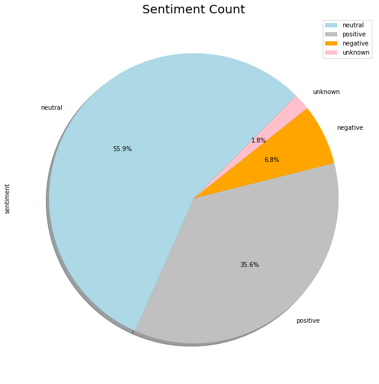
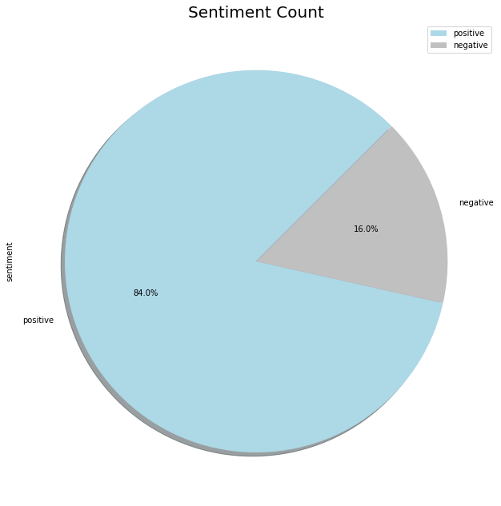
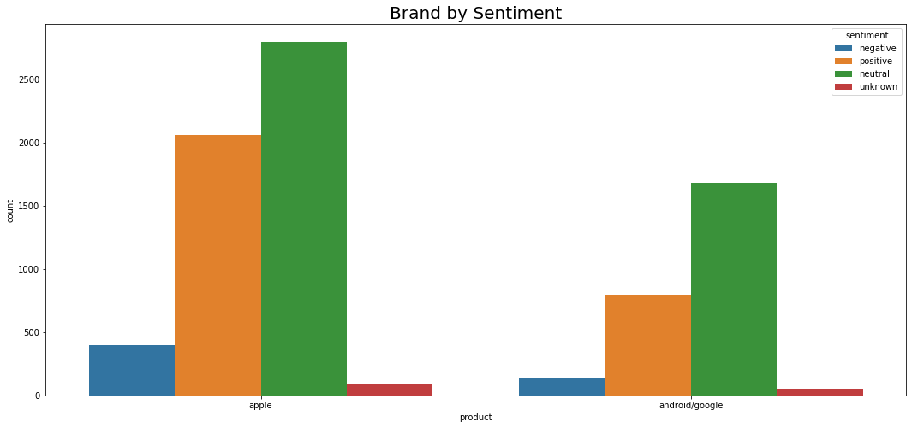

# nlp_project
nlp/neural network tweet sentiment analysis
### modules needed for download/import
**data cleaning modules
import re
import pandas as pd 
import numpy as np 
import nltk
import string

**visualization modules**
import plotly
import matplotlib.pyplot as plt 
import seaborn as sns
%matplotlib inline

**import modules for cleaning, tokenizing and stemming **
from bs4 import BeautifulSoup
from nltk.collocations import *
from nltk.corpus import stopwords
from nltk.stem import SnowballStemmer
import nltk
from nltk import pos_tag
from collections import defaultdict
from nltk.stem import WordNetLemmatizer 
from collections import Counter
from nltk.tokenize.treebank import TreebankWordTokenizer, TreebankWordDetokenizer, TweetTokenizer
from nltk.probability import FreqDist
from io import StringIO
import random

**import modules for modeling data**
from sklearn import preprocessing
from sklearn.preprocessing import LabelEncoder, OneHotEncoder, LabelBinarizer
from tensorflow import keras
from keras.preprocessing.text import Tokenizer
from keras import models, layers, optimizers, initializers, callbacks, regularizers
from keras.models import Sequential
from keras.layers import Dense, Flatten, Embedding, Input, Activation, BatchNormalization
from sklearn.feature_extraction.text import TfidfVectorizer, CountVectorizer, TfidfTransformer
from imblearn.over_sampling import SMOTE
from sklearn.pipeline import Pipeline
from sklearn.metrics import confusion_matrix
from sklearn.decomposition import PCA
from sklearn.decomposition import IncrementalPCA    
from sklearn.manifold import TSNE                    
from sklearn import metrics
from sklearn.metrics import accuracy_score
from sklearn.metrics import precision_score
from sklearn.metrics import recall_score
from sklearn.metrics import f1_score
from sklearn.metrics import roc_auc_score
from sklearn.model_selection import train_test_split
import gensim
import WordCloud

# Goal: create a model that can analyze tweet terms to predict whether sentiment is positive or negative 
### Obtain data
#Build an NLP model to analyze Twitter sentiment about Apple and Google products. The dataset comes from CrowdFlower via data.world. Human raters rated the sentiment in tweets in provided dataset. Link to data used:
https://data.world/crowdflower/brands-and-product-emotions 

Data is unbalanced, and i opt for binary classification for positive / negative to begin with, still unbalanced but limiting classes to minimize balance issues.

### scrub data
got rid of duplicates, NaN values. use regex to clean data.
use regex to clean up punctuation, contractions, extra spaces, etc
treebank tokenizer used due to detokenizer availability , removed stopwords including brand and product names to remove bias as Apple has larger number of tweets, more positive sentiment tweets
maybe due to sample obtained relating to event(sxsw). 

stemmed and lemmatized tweets to compare, used lemmatized tweets for models

### create neural network in keras with tfidf vectors
SMOTE balanced data
non SMOTE data using weights 
### statistical methods
bayes
random forest
knn
### word embeddings with word2vec, creating neural network to evaluate performance
save word2vec model

### provide final model with best performance overall

